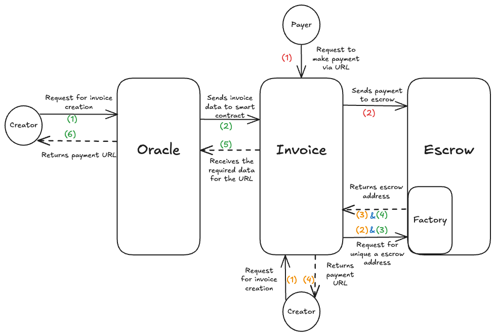

# Blockhead Overview

Welcome to Blockhead. Here, you will get a detailed overview of the project. This will serve as a comprehensive guide to understanding the blueprint and operation of the Blockhead payment processor.

## Table Of Content

1. [What is blockhead?](#what-is-blockhead)
   - [Getting started](#getting-started)
   - [The Creator](#the-creator)
   - [The Payer](#the-payer)
   - [How Blockhead Guarantees Security](#how-blockhead-guarantees-security)
   - [Managing Your Transactions](#managing-your-transactions)
   - [Disputes and Refunds](#disputes-and-refunds)
   - [Future Plan](#future-plans)
2. [Blockhead Technical Documentation](#blockhead-technical-documentation)
   - [Transaction Flow](#transaction-flow)
   - [Smart Contracts](#smart-contracts)
     - [Invoice Contract](#invoice)
     - [Escrow Contract](#escrow)
   - [Marketplace Oracle](#marketplace-oracle)

## What is Blockhead?

Blockhead is a platform on the polygon blockchain used for paying for goods and services. This payment system makes use of cryptocurrency as a medium of transaction; specifically, it uses POL(matic) on the polygon blockchain. It is decentralized, open-source, and requires no permission to join; this is unarguable, meaning anyone can engage on this platform as long as the user owns a wallet on the Polygon blockchain. Blockhead grants safe payment through the use of smart contracts (smart contracts are no-trust codes). Payments are held in the escrow until the condition for release are met, with an [oracle](https://chain.link/education/blockchain-oracles) in place to handle disputes when necessary.

### Getting started

Go to our website at blockhead.box to access Blockhead. You can connect your [Web3 wallet](https://quicknode.com/guides/web3-fundamentals-security/basics-to-web3-wallets) to the platform's user-friendly interface for convenient feature access. The website is divided into distinct sections for handling transactions, creating invoices, and logging in.

You must first register for an account on Blockhead if you are making invoices that call for the use of Oracles. To use the site and conduct transactions as a payer or creator for any other transactions, all you need to do is connect your Polygon wallet.

**There are two main parties involved performing a transaction on Blockhead:**

- The Creator or Seller
- The Payer or Buyer

## The Creator

A Creator or service provider, can create an invoice for buyers to make payment directly on the platform. Once logged into Blockhead, creators can easily navigate **Create Invoice** page to create an invoice where necessary details are inputted, such as the amount in POL(matic), terms, the invoice expiration (within 180 days, depending on the agreement between the creator and payer), and the Polygon address where the payment should be released.
The platform will generates a personalized invoice ID with a payment link and a QR code. Creators can share this personalized invoice ID or URL or QR Code to the payer enabling them to proceed with payment.
When the payment has been made, the funds are sent to an escrow wallet to be held securely until the conditions for release have been met. The status of your invoice can be monitored on the **Invoice List**.
In cases of underpayment, the payer can either accept or cancel the invoice, depending on the situation. Additionally, creators are obliged to accept the payer’s funds within 3 days; otherwise, this will result in an automatic refund to the payer’s wallet.

## The Payer

A payer can pay for a created invoice on Blockhead. The payer receives an invoice link or a QR code from the creator. Upon opening the link in a browser, payer is redirected to the **Pay Invoice** page, where the details of the invoice, such as the payment amount, invoice expiration date, and the creator’s information is displayed.
To make payment, the payer is required to connect their wallet to Blockhead to proceed with payment in POL(matic). All transactions on Blockheads are tracked and are also updated on the invoice status accordingly.
In cases of overpayment, the excess amount (minus the gas fee) will be automatically refunded to the payer's wallet. When the creator cancels an invoice (maybe due to an underpayment) or it exceeds the expiration, the funds will be refunded to the payer's wallet.

### How Blockhead Guarantees Security

Blockhead takes several precautions to guarantee each payment's security. Until the predetermined requirements for release are met, all the funds are kept in an escrow wallet. Trusted oracles are employed to provide a dependable conclusion in the event of a dispute between the creator and the payer, guaranteeing a fair and open procedure for all sides and ensuring fairness for both the creator and the payer.
Blockhead uses a blockchain oracle to monitor transactions on the Polygon network in order to guarantee precise payment processing and trustworthy tracking.

### Managing Your Transactions

Creators and payers can monitor and manage their transactions on Blockhead. Invoices are displayed on the **Invoice List** page, which can be easily accessed by users. Invoices can be sorted by status, creation date, and other fields. If the creator or payer needs a specific invoice, the search bar allows the creator or payer to search for the invoice using the invoice ID. The current state of the invoice is also displayed, which includes either paid, cancelled, or awaiting release. Creators can also cancel an invoice on this page.

### Disputes and Refunds

If there is a dispute over a payment, Blockhead relies on Oracle to settle the dispute. Invoices created through the marketplace uses the oracle to reallocate funds to the creator or payer based on dispute resolution.

### Future Plan

Blockhead intends to switch to the Polygon zkEVM chain in the future.

# Blockhead Technical Documentation

The pages here provide guides and technical documentation for Blockhead. You can refer to these resources to understand the Blockhead Protocol Smart Contracts and how Oracles are used.

- Invoice: The smart contract manages the invoice process
- Escrow: Creates a unique wallet and stores payment
- Marketplace Oracle: Its purpose includes delivering invoice data to the smart contracts, determines escrow hold period & post-dispute allocations

## Transaction Flow

Each components use during a transaction is illustrated in the diagram below

<p align="center">
  
</p>

1. Request for Invoice Creation:In the case of using an oracle, the Creator asks Oracle to produce an invoice with information such as the amount due and the date of expiration otherwise the information is sent directly to the smart contract.

2. Oracle Provides Data to Smart Contract: The invoice data is sent by Oracle to the invoice smart contract so that it may be processed.

3. Smart Contract Requests Escrow Address: The invoice smart contract requests that the Escrow Factory generate a special escrow address for the invoice and it is sent back to the invoice smart contract

4. Payment URL Generated: A payment URL is created by the invoice smart contract by emitting an event with the escrow address and sent to the creator.

5. Payer Accesses URL: The payment procedure is started by the Payer using the payment URL that the Creator supplied.

6. Payment Sent to Escrow: The Payer transfers the designated sum of money straight to the distinct escrow address that the Escrow smart contract controls.

7. Escrow Holds Funds: Until release conditions, including invoice approval, dispute settlement, or refund triggers, are satisfied, the money is safely held by the Escrow smart contract.

## Smart Contracts

Check [here](./flowchart.png) for more a detailed interaction between the three major components

### INVOICE

The invoice contract is the main entry to the smart contract. It coordinates the distribution of funds by making it possible to change state, tracking payments, and guaranteeing that invoices are created successfully, through integration with oracles and the Escrow Factory.

**Below are very basic functions and states needed for the contract:**

#### Invoice states

This ID increments by 1 for each new invoice created. Using `uint256` allows for `2**256 - 1` invoice to be created

```typescript
uint256 public invoiceId;
```

#### Invoice Status

```typescript
enum Status {
        Created
        Pending,
        Accepted,
        Paid,
        Refunded,
        Indipsute
    }
```

#### Invoice Creation data

```typescript
struct InvoiceData {
        address creator;
        address escrow;
        address payer;
        uint80 dueDate;
        Status status;
        uint256 amount
    }
```

#### Invoice Creation function

This functions handles the creation, cancelling, payment and release of invoice. This are major functions needed for the invoice contract. It contains necessary checks inline with the protocol and emits event for off chain use.

```typescript
function createInvoice(address _payer, uint256 _amount, uint256 _expiration) public return(uint256 invoiceId);

function payInvoice(uint256 _invoiceId) payable external;

function releaseFunds(uint256 _invoiceId) external;

function cancelInvoice(uint256 _invoiceId) external;

function reAllocateDisputeFunds(uint256 _invoiceId) external;

function getListOfInvoice(address _creator) external view returns(InvoiceData[] memory);
```

### Escrow

**The escrow contains two main contract:**

- Escrow Wallet
- Escrow Factory

#### Escrow factory

It creates the escrow wallet using the [CREATE2](https://eips.ethereum.org/EIPS/eip-1014) OPCODE. Create2 makes a it possible to create a deterministic and unique address with the use of a salt(any random data), creators address is used in this case.

We will make use of the Create2 library by [Openzeppelin](https://github.com/OpenZeppelin/openzeppelin-contracts/blob/master/contracts/utils/Create2.sol)

```typescript
function createWallet(bytes32 _salt) external onlyInvoiceContract returns(address){
    returns Create2.deploy(0, _salt, type(EscrowWallet).creationCode);
}
```

The `deploy` method returns the address for the newly created escrow wallet

### Escrow Wallet

This contract holds the amount of value sent by the payer. It is created by the Escrow factory contract in the Invoice contract

```typescript
uint256 public amountDepositedByPayer
```

The `amountDepositedByPayer` will be used to check the amount sent to the wallet by the payer. This is preferred over `address(this).balance` simply because a random wallet could send POL(matic) to the wallet resulting in inconsistencies. This will be duly handled.

The functions below handles the deposit and withdrawal of value. They perform necessary checks, which involve allowing only the authorized withdrawals and verifying the current status of an invoice before it is sent out.

```typescript
function deposit() payable external;
function withdraw() external;
```

## Marketplace Oracle

In Blockhead, we use the [chainlink](https://chain.link/) oracle. The [chainlink automation](https://docs.chain.link/chainlink-automation/overview/getting-started) features allows for easy handling of states in our invoice contract. It has the ability to interact with the invoice contract and perform specific actions such as the ability to trigger `Invoice::reAllocateDisputeFunds` in state of dispute.

## Role Accounts

These are accounts that has privileged functions. The first admin key and confirmation key are encoded in the smart contract for secure access, and the admin operations in Blockhead are controlled via the admin interface at blockhead.box/admin(for only authorized accounts). Administrators can set up the Marketplace Oracle address, suspend operations using the Shut-Off Switch, and transfer keys with secondary confirmation. Critical functions require a second confirmation, and the administrator also sets up the gas fees, Blockhead Fee Margin, and Escrow Wallet address. The administrator establishes default Hold Times for contracts, configures Market Oracle parameters, and sets the Blockhead Wallet Address for handling gas fees and collecting platform fees. To guarantee seamless platform operation and security, they can create Circuit Breakers in the smart contract, blacklist wallets, and initiate events to resend stopped transactions.
